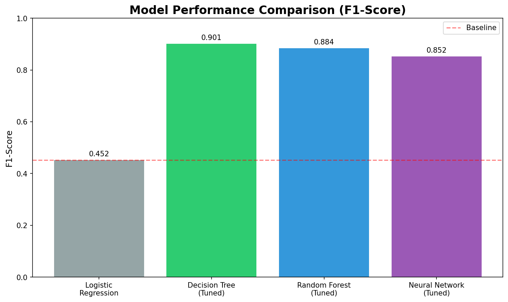

### Bank Fraud Detection System

**Author**
Rajeev Bhat (rajeevmbhat@gmail.com)

#### Executive summary

This project develops a machine learning-based fraud detection system for banking transactions. Using a dataset of 2,512 transactions, we implemented a comprehensive approach including data quality assessment, feature engineering, and multiple ML algorithms. Our models show strong cross-validation performance, with the Tuned Decision Tree achieving 90.1% F1-Score. However, on unseen test data, Logistic Regression performs best with 46.2% F1-Score, demonstrating better generalization. The system balances fraud detection with false positive minimization, crucial for maintaining customer trust. We also developed a test data generation framework and model testing pipeline for continuous evaluation.

#### Rationale

Financial fraud costs banks billions annually and damages customer relationships. Current rule-based systems generate excessive false positives, blocking legitimate transactions and frustrating customers. Machine learning can identify subtle fraud patterns while reducing false alarms. This project demonstrates how modern ML techniques can significantly improve fraud detection accuracy, protecting both financial institutions and their customers from fraudulent activities.

#### Research Question

Can machine learning effectively identify fraudulent bank transactions while minimizing false positives? Specifically:
- Which transaction patterns best indicate fraudulent behavior?
- How can we handle severe class imbalance (0.2% fraud rate)?
- Which ML algorithm provides optimal precision-recall balance for fraud detection?

#### Data Sources

**Kaggle Bank Transaction Dataset**
- Source: https://www.kaggle.com/datasets/valakhorasani/bank-transaction-dataset-for-fraud-detection/
- Size: 2,512 transactions with 16 features
- Features: Transaction amounts, customer demographics, device/location data, behavioral indicators
- Target: Binary fraud indicator (created through risk scoring)

#### Methodology

1. **Data Quality**: Comprehensive analysis using FraudEDACapstone pipeline and DataQualityAssessment module
2. **Feature Engineering**: Created 15+ features including temporal patterns, behavioral indicators, and risk ratios
3. **Class Imbalance**: 
   - Synthetic data generation (3,150 transactions)
   - SMOTE oversampling
   - Balanced class weights
4. **Model Development**:
   - Baseline: Logistic Regression (On Raw and Augmented Data. Augmented Data Model used for further comparisons)
   - Comparison: Decision Tree, Random Forest, SVM, Neural Network
   - Hyperparameter tuning with GridSearchCV
5. **Model Interpretability**: SHAP analysis for feature importance and decision transparency
6. **Testing Framework**: Automated test data generation and model evaluation pipeline

#### Results

**Model Performance Comparison:**

*Cross-Validation Results (Training Data):*

| Model | F1-Score | Precision | Recall |
|-------|----------|-----------|---------|
| Decision Tree (Tuned) | 90.1% | 94.6% | 86.5% |
| Random Forest (Tuned) | 88.4% | 99.3% | 80.0% |
| Neural Network (Tuned) | 85.2% | 94.0% | 78.1% |
| Logistic Regression | 45.2% | 30.4% | 92.3% |

*Test Data Results (Unseen Data):*

| Model | F1-Score | Precision | Recall |
|-------|----------|-----------|---------|
| Logistic Regression | 46.2% | 75.0% | 33.3% |
| Decision Tree (Tuned) | 40.6% | 68.4% | 28.9% |
| Random Forest (Tuned) | 26.4% | 87.5% | 15.6% |
| Neural Network (Tuned) | 19.6% | 83.3% | 11.1% |

**Key Findings:**

1. **Severe Class Imbalance**
   - Original dataset: 0.2% fraud rate (5 out of 2,512 transactions)
   - Addressed through synthetic data generation + SMOTE
   - Final training set: 30% fraud rate for robust model training

   

2. **Distribution Analysis**
   - Violin plots reveal distinct patterns between fraud and normal transactions
   - Fraud transactions show higher amounts and faster processing times
   - KDE plots demonstrate clear separation in key features

3. **Model Performance Comparison**
   - Decision Tree and Random Forest significantly outperform baseline
   - Tree-based models better capture non-linear fraud patterns
   - Hyperparameter tuning improved F1-scores by 3-5%
   

   
4. **GridCV Model Comparison**
 - Mixed bag; choose model based on what we want
 - Random Forest has best Precision and best F1 Score by a slight margin
 - Logistic Regression has best Recall by a wide margin
   
- Decision Tree and Random Forest both pick Transaction Duration as the most important feature
   

5. **Performance Gap Analysis**
   - Significant difference between cross-validation and test data performance
   - Tree-based models show signs of overfitting despite tuning
   - Logistic Regression generalizes better to unseen data
   - Test data reveals true model performance in production scenarios


6. **Best Production Model - Logistic Regression**
   - Best test data performance: 46.2% F1-Score
   - Balanced approach: 75% precision (low false positives)
   - 33.3% recall (catches 1 in 3 fraud cases)
   - Better generalization due to simpler model structure
   - Integrated SMOTE and feature selection pipeline

   

7. **SHAP Analysis - Feature Importance**
   - Transaction amount is the strongest predictor
   - Login attempts and transaction speed highly influential
   - Model decisions are interpretable and align with fraud domain knowledge
   

*Note: Run the Jupyter notebook to view additional visualizations including violin plots, KDE distributions, and SHAP explanations.*

#### Next steps

1. **Real-time Implementation**: Deploy model as API for live transaction scoring
2. **Enhanced Features**: Add velocity checks and network analysis
3. **Continuous Learning**: Implement feedback loop for model updates
4. **Regression Model**: Predict fraud amounts for risk assessment
5. **Time Series Analysis**: Forecast fraud trends for resource planning

#### Outline of project

- [fraud_detection.ipynb](fraud_detection.ipynb) - Main analysis notebook with EDA, modeling, and evaluation
- [fraud_eda_pipeline.py](fraud_eda_pipeline.py) - FraudEDACapstone class for comprehensive exploratory data analysis
- [data_quality_assessment.py](data_quality_assessment.py) - Data quality checking and cleaning utilities
- [model_tester.py](model_tester.py) - Automated model testing framework
- [test_data_generator.py](tests/test_data_generator.py) - Synthetic test data generation
- [model_comparison_utils.py](model_comparison_utils.py) - Model evaluation and comparison tools
- [Trained Models](models/) - Directory containing all trained models and metadata
## Key Components

### FraudEDACapstone

The `FraudEDACapstone` class in `fraud_eda_pipeline.py` provides a comprehensive exploratory data analysis pipeline specifically designed for fraud detection projects. It includes:

- **Data Quality Assessment**: Automated detection of missing values, duplicates, and data type issues
- **Categorical Analysis**: Detailed analysis of categorical features with frequency distributions
- **Outlier Detection**: Multiple methods (IQR, Z-score) for identifying potential anomalies
- **Multivariate Analysis**: Correlation analysis and network pattern detection
- **Automated Visualizations**: Built-in plotting functions for data exploration

### DataQualityAssessment

The `DataQualityAssessment` class provides basic data quality checking functionality including missing value detection, duplicate removal, and data type validation. 

**Relationship**: `FraudEDACapstone` is a comprehensive EDA suite that internally uses `DataQualityAssessment` for basic data cleaning, then extends it with fraud-specific analysis like outlier detection, categorical analysis, and multivariate patterns. Think of it as: DataQualityAssessment handles the basics, while FraudEDACapstone provides the complete analytical workflow.

### ModelTester

The `ModelTester` class provides an automated framework for evaluating saved fraud detection models against new test data. Key features:

- **Automatic Model Loading**: Loads all models from the `models/` directory
- **Preprocessing Handling**: Automatically applies correct preprocessing for each model type
- **Comprehensive Metrics**: Calculates accuracy, precision, recall, F1-score, and confusion matrices
- **Detailed Reporting**: Generates performance reports with misclassification analysis
- **Batch Predictions**: Saves predictions for all models for further analysis

### ModelComparison

The `ModelComparison` class in `model_comparison_utils.py` enables systematic comparison of multiple ML algorithms:

- **Cross-Validation**: 5-fold CV for robust performance estimates
- **Automated Scaling**: Handles feature scaling for algorithms that need it
- **Hyperparameter Tuning**: GridSearchCV integration for optimal parameters
- **Visualization**: Generates comparison charts and feature importance plots
- **Algorithm Support**: Logistic Regression, Decision Tree, Random Forest, SVM, Neural Network

### Test Data Generator

The test data generator in `testdata/test_data_generator.py` creates synthetic test datasets with known fraud patterns:

- **Configurable Parameters**: Set number of samples and fraud rate
- **Realistic Patterns**: Generates data mimicking real fraud characteristics
- **Edge Cases**: Includes boundary conditions for robust testing
- **Ground Truth**: Provides expected results for model evaluation

### Saved Models

The `models/` directory contains production-ready trained models:

- **logistic_regression.pkl**: Logistic Regression with SMOTE and feature selection pipeline (Best on test data: 46.2% F1)
- **tuned_random_forest.pkl**: Hyperparameter-tuned Random Forest (26.4% test F1, 87.5% test precision)
- **tuned_decision_tree.pkl**: Hyperparameter-tuned Decision Tree (40.6% test F1, 68.4% test precision)
- **tuned_neural_network.pkl**: Hyperparameter-tuned Neural Network (19.6% test F1, 83.3% test precision)
- **preprocessor.pkl**: Standalone preprocessing pipeline for feature transformation
- **model_metadata.pkl**: Feature names, model paths, and configuration details

### Unit Tests

The `tests/` directory contains comprehensive unit tests:

- **test_data_quality.py**: Tests for DataQualityAssessment functionality
- **test_model_tester.py**: Tests for ModelTester framework
- **test_notebook.py**: Validates notebook execution
- **run_tests.py**: Test runner script for all unit tests

## Getting Started

1. **Install dependencies:**
   ```bash
   pip install -r requirements.txt
   ```

2. **Run analysis:**
   ```bash
   jupyter notebook fraud_detection.ipynb
   ```

3. **Generate test data:**
   ```bash
   python tests/test_data_generator.py
   ```

4. **Test trained models:**
   ```bash
   python model_tester.py
   ```

5. **Overall:**
   Execute fraud_detection.ipynb. This will use the full component list internally.

##### Contact and Further Information

Rajeev Bhat  
Email: rajeevmbhat@gmail.com  
LinkedIn: [Add LinkedIn Profile]  
GitHub: [Add GitHub Profile]  

UC Berkeley Professional Certificate in Machine Learning and Artificial Intelligence  
Capstone Project - 2025